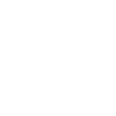

# 🏆 Project Kratos — Bonus Maze Challenge

**Solve a maze autonomously. Fastest time skips interviews.**

This repository gives you a Docker-based **Ubuntu 22.04 + ROS 2 Humble** environment. Everything else — simulation, robot, solver — is **up to you**.

---

## ⚡ Quick Start

### Prerequisites

- A Linux machine (Ubuntu 20.04+ recommended)
- ~6 GB free disk space

### 1. Clone this repo

```bash
git clone https://github.com/<your-org>/induction_docker_repo.git
cd induction_docker_repo
```

### 2. Run setup (one-time)

```bash
chmod +x setup.sh kratos-env.sh
./setup.sh
```

This installs Docker (if needed), sets up GPU passthrough (if you have an NVIDIA GPU), and pulls the container image.

### 3. Start the environment

```bash
./kratos-env.sh start
```

### 4. Open the desktop

Open **http://localhost:6080/vnc.html** in your browser. You now have a full Linux desktop with ROS 2 Humble.

### 5. Open a terminal inside the container

```bash
./kratos-env.sh shell
```

ROS 2 Humble is pre-sourced. You have `sudo` access (no password) to install whatever you need.

---

## 📂 What You Get

| What | Description |
|------|-------------|
| **Ubuntu 22.04** | Full OS inside Docker |
| **ROS 2 Humble** | Pre-installed and sourced (from `osrf/ros:humble-desktop-full`) |
| **noVNC Desktop** | Full Linux desktop at `http://localhost:6080/vnc.html` |
| **Maze Maps** | 5×5 and 10×10 maze models in `kratos_maze/` |
| **sudo access** | Install any package you need: `sudo apt install <package>` |

### What You **Don't** Get (on purpose)

| What | Why |
|------|-----|
| ❌ Gazebo / any simulator | **You** install and configure it |
| ❌ TurtleBot3 / any robot | **You** choose and set up your robot model |
| ❌ Nav2 | **BANNED** — see rules below |
| ❌ Launch files | **You** write your own |
| ❌ Sample solver | **You** write your own algorithm |

---

## 🗺️ The Maze

<p align="center">
  
  &nbsp;&nbsp;&nbsp;&nbsp;&nbsp;&nbsp;
  <br>
  <em>10×10 Maze &nbsp;&nbsp;&nbsp;&nbsp;&nbsp;&nbsp;&nbsp;&nbsp;&nbsp;&nbsp;&nbsp;&nbsp;&nbsp;&nbsp;&nbsp;&nbsp;&nbsp;&nbsp;&nbsp;&nbsp;&nbsp;&nbsp;&nbsp;&nbsp;&nbsp;&nbsp;&nbsp;&nbsp;&nbsp;&nbsp;&nbsp;&nbsp;&nbsp;&nbsp;&nbsp;&nbsp; 5×5 Maze</em>
</p>

The `kratos_maze/` directory contains the maze assets you need:

```
kratos_maze/
├── models/
│   ├── maze5x5/        ← 5×5 maze model (SDF + OBJ mesh)
│   ├── maze10x10/      ← 10×10 maze model (SDF + OBJ mesh)
│   └── sample/         ← sample walls model
├── worlds/
│   ├── maze5x5.world   ← Gazebo-classic world file
│   └── maze10x10.world ← Gazebo-classic world file
└── assets/             ← SVG/PNG images of the mazes
```

See the [kratos_maze README](kratos_maze/README.md) for details on how to build and access these files.

---

## 🎯 The Challenge

**Solve the 10×10 maze in the fastest time possible.**

Your robot must navigate autonomously from the start point to the finish point.

### Rules

1. **No Nav2.** You may NOT use `ros-humble-navigation2`, `ros-humble-nav2-bringup`, or any Nav2 package. **Using Nav2 = instant disqualification.**
2. **No external intervention.** Once your solver script starts, the robot must navigate on its own. No teleop, no manual waypoints.
3. **No boundary tricks.** The robot must navigate _through_ the maze, not around the outer walls.
4. **Timer starts** when you run your final solver script. Utility/setup scripts don't count.
5. **You must record a video** of the bot solving the maze.
6. **Submit your code + video** via the submission form (link below).

### What You Must Do Yourself

1. **Install a simulator** (e.g., Gazebo Classic, Gazebo Fortress, or any ROS 2-compatible sim)
2. **Set up a robot** in the simulation (TurtleBot3, custom URDF, whatever you want)
3. **Import the maze** into your simulator using the provided models/worlds
4. **Write your own maze-solving algorithm** — wall following, BFS, A*, SLAM-based, or anything creative
5. **Create your own launch files** to tie everything together

### Prize

🏅 **The fastest valid submission gets to skip interviews.**

---


## 🔧 CLI Commands

Run these from the repo directory:

```
./kratos-env.sh start    Start the dev container (or resume a stopped one)
./kratos-env.sh stop     Stop the container (installed packages are preserved)
./kratos-env.sh status   Check if the container is running
./kratos-env.sh shell    Open a bash shell inside the container (ROS2 pre-sourced)
./kratos-env.sh reset    Destroy the container and start fresh
```

### Your Workspace

- **Host:** `~/ros2_ws/` → **Container:** `/workspace/`
- Files you create on either side appear on both
- Files are owned by your user (not root)

```bash
# Inside the container — build your packages
cd /workspace
mkdir -p src
# put your packages in src/
colcon build
source install/setup.bash
```

---

## 🛠 Troubleshooting

**"Permission denied" on docker commands**
```bash
sudo usermod -aG docker $USER
newgrp docker    # or log out and back in
```

**Need to install a package inside the container**
```bash
sudo apt update
sudo apt install <package>
```

**Container starts but noVNC doesn't load**
```bash
./kratos-env.sh status      # is it running?
docker logs kratos_dev     # check for errors
```


---

Join the [Discord](https://discord.gg//WWW7muQA) server for updates and questions. Good luck! 🚀
